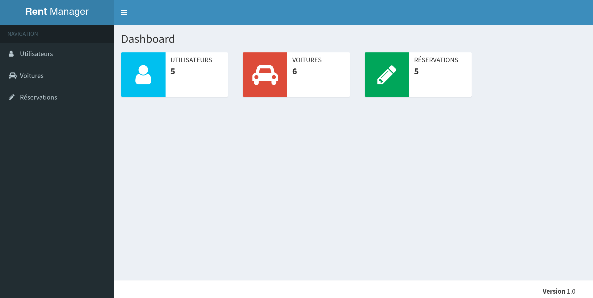

#############
Rent Manager
#############

A study program to explore making web applications using Java by creating a rental-tracking
software for a mock rental agency.

Use
====

This project uses `Maven <https://maven.apache.org>`_ as a build system and Tomcat as a web server.

To install the dependencies and build the project::

    mvn clean install

Before anything else, execute the class ``com.epf.rentmanager.FillDatabase`` at least once::

    mvn exec:java -Dexec.mainClass="com.epf.rentmanager.persistence.FillDatabase"

To start the web app::

    mvn tomcat7:run

The site is available on http://localhost:8080/rentmanager.

Architecture
=============

.. image:: architecture.svg
	:align: center

Dependencies
=============

This project was build using Java 17.

- `H2 database <https://h2database.com>`_
- `Tomcat <https://tomcat.apache.org>`_
- Servlet
- `Spring <https://sptring.io>`_
- `JUnit <https://junit.org/junit4/>`_
- `Mockito <https://site.mockito.org/>`_

License
========

This project is licenced under the Mozilla Public Licence 2.0.

Acknowledgements
================

This project was part of a scholar assignment. The initial codebase (commits
ff425669bfb596f419192d1d7b695165ab42d512 and
e7c5bd9db99c7cc051c916ae8cc86580cd9f602f) is not mine.