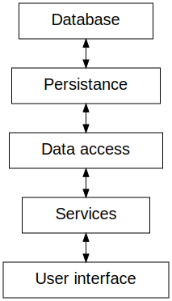

#############
Rent Manager
#############

A study program to explore making web applications using Java by creating a rental-tracking
software for a mock rental agency.

Use
====

This project uses `Maven <https://maven.apache.org>`_ as a build system and Tomcat as a web server.

Before anything else, execute the class ``com.epf.rentmanager.FillDatabase`` at least once.

To start the web app::

    mvn tomcat7:run

The site is available on http://localhost:8080/rentmanager.

Architecture
=============

Dependencies
=============

This project was build using Java 17.

- `H2 database <https://h2database.com>`_
- `Tomcat <https://tomcat.apache.org>`_
- Servlet
- `Spring <https://sptring.io>`_
- `JUnit <https://junit.org/junit4/>`_
- `Mockito <https://site.mockito.org/>`_

License
========

Acknowledgements
================
